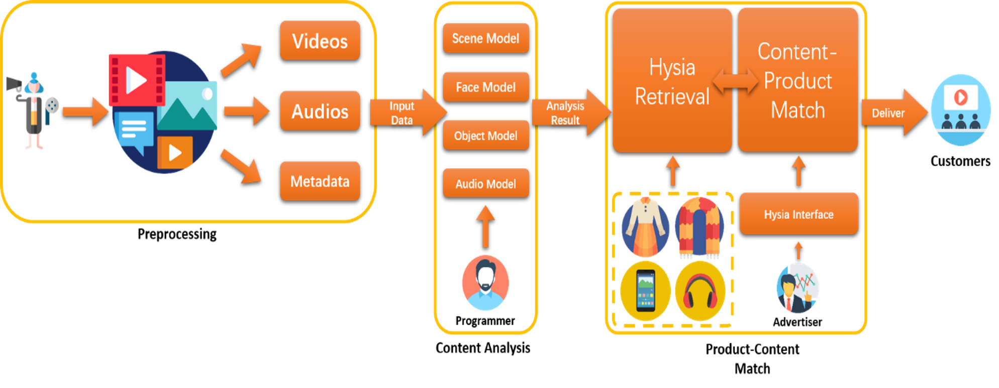

# Hysia Video to Online Platform \[V1.0\]
<sub>* This project is supported by 
[Cloud Application and Platform Lab](https://wiki.withcap.org) 
led by [Prof. Yonggang Wen](https://www.ntu.edu.sg/home/ygwen/)</sub>  

An intelligent multimodal-learning based system for video, product and ads analysis. You can build various downstream 
applications with the system, such as product recommendation, video retrieval. Several examples are provided.

**V2** is under active development currently. You are welcome to create a issue, pull request here. We will credit them
into V2.



## Table of Contents

1. [Showcase](/#showcase)
2. [Features](/#features)
3. [Download Data](/#download-data)
4. [Installation](/#installation)
5. [Configuration](/#configuration)
6. [Demo](/#demo)
7. [Some Useful Tools](/#some-useful-tools)
8. [Todo List](/#todo-list)
9. [Credits](/#credits)
10. [Contribute to Hysia-V2O](/#contribute-to-hysia-v2o)
11. [About Us](/#about-us)

## Showcase

:point_right: Full list of [showcase](./show-case.md).

<ol>
<li> Upload video and process it by selecting different models  


</li>

<li> Display video processing result  
    


</li>

<li> Search scene by image and text
    


</li>

<li> Insert product advertisement and display insertion result
    


</li>

</ol>

## Features

- Multimodal learning-based video analysis:
    - Scene / Object / Face detection and recognition
    - Multimodality data preprocessing
    - Results align and store
- Downstream applications:
    - Intelligent ads insertion
    - Content-product match
- Visualized testbed
    - Visualize multimodality results
    - Can be installed seperatelly

## Quick Start

:point_right: For [step-by-step start](./Step-by-step-start.md).

### 1. Download Data

:point_right: For [no Google Drive access](./Step-by-step-start.md#1-download-data) :x:

```shell script
# Make sure this script is run from project root
bash scripts/download-data.sh
cd ..
```

### 2. Installation

Requirements:
- Conda
- Nvidia driver
- CUDA = 9[*](#todo-list)
- CUDNN
- g++
- zlib1g-dev

These scripts are tested on Ubuntu 16.04 x86-64 with CUDA9.0 and CUDNN7. Docker is recommended for other system version.   

#### Option 1: Use Docker  

See [Run with Docker](docker/README.md) to build and install. 

#### Option 2: Auto-installation

Run the following script:
```shell script
# Execute this script at project root
bash scripts/install-build.sh
cd ..
```

### (Optional) Rebuild the frontend
You can omit this part as we have provided a pre-built frontend. If the frontend is updated, please run the following:  

```shell script
cd server/react-build
bash ./build.sh
```

## Configuration
<ul>
<li> Decode hardware:  

Change the configuration [here](server/HysiaREST/settings.py) at last line:  
```python
DECODING_HARDWARE = 'CPU'
```
Value can be `CPU` or `GPU:<number>` (e.g. `GPU:0`)
</li>
<li> ML model running hardware:

Change the configuration of model servers under this [directory](server/model_server):
```python
import os

# Custom request servicer
class Api2MslServicer(api2msl_pb2_grpc.Api2MslServicer):
    def __init__(self):
        ...
        os.environ['CUDA_VISIBLE_DEVICES'] = '0'
```
A possible value can be your device ID `0`, `0,1`, ...

</li>
</ul>

## Demo
```shell script
cd server

# Start model server
python start_model_servers.py

# Run Django
python manage.py runserver 0.0.0.0:8000
```

Then you can go to http://localhost:8000. Use username: admin and password: admin to login.

## Some Useful Tools

- Large dataset preprocessing
- Video/audio decoding
- Model profiling
- Multimodality data testbed

## Todo List

- [ ] Improve models
- [ ] Improve documents
- [ ] CUDA 10 support
- [x] Docker support
- [ ] Frontend separation
- [ ] A minimal product database 
- [ ] HysiaDecode 18.04 support
- [ ] HysiaDecode Docker GPU support

## Credits

Here is a list of models that we used in Hysia-V2O. 

| Task                  | Model Name                  | License    | GitHub Repo |
| --------------------- |:---------------------------:|:----------:|:-----------:|
| MMDetection           |                             |            |             |
| Object detection      |                             | Apache-2.0 | [TensorFlow detection model zoo] |
|                       | [SSD MobileNet v1 COCO]     |            |             |
|                       | [SSD Inception v2 COCO]     |            |             |
|                       | [FasterRCNN ResNet101 COCO] |            |             |
| Scene Recognition | | |
| Audio Recognition | | |
| Image Retrieval | | |
| Face Detection | | |
| Face Recognition | | |
| Text Detection| | |
| Text Recognition| | |

## Contribute to Hysia-V2O

You are welcome to pull request. We will credit it in our version 2.0.

## About Us

### Maintainers
- Huaizheng Zhang [[GitHub]](https://github.com/HuaizhengZhang)
- Yuanming Li yli056@e.ntu.edu.sg [[GitHub]](https://github.com/YuanmingLeee)
- Qiming Ai [[GitHub]](https://github.com/QimingAi)
- Shengsheng Zhou [[GitHub]](https://github.com/ZhouShengsheng)

### Previous Contributors
- Wenbo Jiang (Now, Shopee) [[GitHub]](https://github.com/Lancerchiang)
- Ziyuan Liu (Now, Tencent) [[GitHub]](https://github.com/ProgrammerYuan)
- Yongjie Wang (Now, NTU PhD) [[GitHub]](https://github.com/iversonicter)


[Tensorflow detection model zoo]: https://github.com/tensorflow/models/blob/master/research/object_detection/g3doc/detection_model_zoo.md
[SSD MobileNet v1 COCO]: http://download.tensorflow.org/models/object_detection/ssd_mobilenet_v1_coco_2018_01_28.tar.gz
[SSD Inception v2 COCO]: http://download.tensorflow.org/models/object_detection/ssd_inception_v2_coco_2018_01_28.tar.gz
[FasterRCNN ResNet101 COCO]: http://download.tensorflow.org/models/object_detection/faster_rcnn_resnet101_coco_2018_01_28.tar.gz

