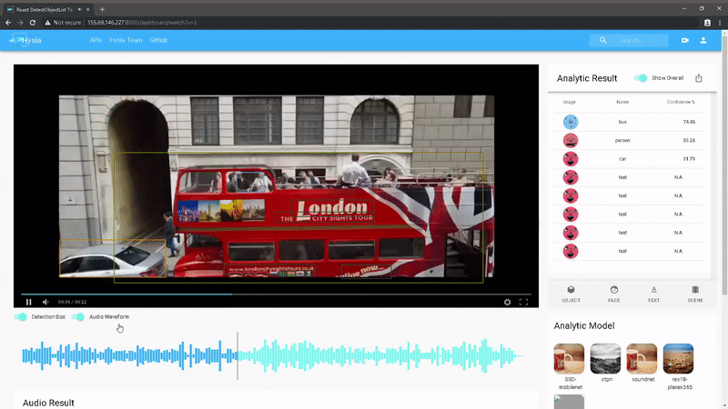

# Hysia Video to Online Platform \[V1.0\]
An intelligent learning-based multimodal system for video, product and ads analysis. You can build various downstream 
applications with the system, such as product recommendation, video retrieval. Several examples are provided.

**V2** is under active development currently. You are welcome to create a issue, pull request here. We will credit them into V2.


## Highlights
- Multimodal learning-based video analysis:
    - Scene / Object / Face detection and recognition
    - Multimodality data preprocessing
    - Results align and store
- Downstream applications:
    - Intelligent ads insertion
    - Content-product match
- Visualized testbed
    - Visualize multimodality results
    - Can be installed seperatelly


## Showcase

#### 1. Upload video and process it by selecting different models  


    


#### 2. Display video processing result  


    

    


#### 3. Search scene by image and text  


    


#### 4. Insert product advertisement and display insertion result    


    


## Installation

We recommend to install this V2O platform in a UNIX like system. These scripts are tested on Ubuntu 16.04 x86-64 with 
CUDA9.0 and CUDNN7.  

In case some dependent libraries used in Hysia Decoder haven't been installed in your system, you can kindly download
them from [Google Drive](https://drive.google.com/open?id=16FfKT1IRXFwv7PjqNvhOEXzUxRAD-3Sa) (Linux x86-64 only), and 
unzip it before installation:
```shell script
mv hysia-decoder-lib-linux-x86-64.tar.gz hysia/core/HysiaDecode
cd hysia/core/HysiaDecode
tar xvzf hysia-decoder-lib-linux-x86-64.tar.gz
cd ../../../
```

Please try `chmod +x <script>` if something does not work.  

#### Option 1. Step-by-step installation 
```shell script
# Firstly, make sure that your Conda is setup correctly and have CUDA,
# CUDNN installed on your system.

# Install Conda virtual environment
conda env create -f environment.yml

conda activate Hysia

export BASE_DIR=${PWD}

# Compile HysiaDecoder
cd "${BASE_DIR}"/hysia/core/HysiaDecode
make clean && make CPU_ONLY=TRUE

# Build mmdetect
# ROI align op
cd "${BASE_DIR}"/third/
cd mmdet/ops/roi_align
if [ -d "build" ]; then
    rm -r build
fi
python setup.py build_ext --inplace

# ROI pool op
cd ../roi_pool
if [ -d "build" ]; then
    rm -r build
fi
python setup.py build_ext --inplace

# NMS op
cd ../nms
make clean
make PYTHON=python

# Initialize Django
# This will prompt some input from you
cd "${BASE_DIR}"/server
python manage.py makemigrations restapi
python manage.py migrate
python manage.py loaddata dlmodels.json
python manage.py createsuperuser

python -m grpc_tools.protoc -I . --python_out=. --grpc_python_out=. protos/api2msl.proto

unset BASE_DIR
```

#### Option 2: Auto-installation
Run the following script:
```shell script
cd scripts
chmod build.sh
./build.sh
cd ..
```

#### * Optional: Rebuild the frontend  
You can omit this part as we have provided a pre-built frontend. If the frontend is updated, please run the following:  

Option 1: Step-by-step rebuild  
```shell script
cd server/react-front

# Install dependencies
npm i
npm audit fix

# Build static files
npm run-script build

# fix js path
python fix_js_path.py build

# create a copy of build static files
mkdir -p tmp
cp -r build/* tmp/

# move static folder to static common
mv tmp/*html ../templates/
mv tmp/* ../static/
cp -rfl ../static/static/* ../static/
rm -r ../static/static/

# clear temp
rm -r tmp
```

Option 2: auto-rebuild
```shell script
cd server/react-build
chmod +x ./build.sh
./build.sh
```

## Download Data
1\. Download pretrained model weights from [Google Drive](https://drive.google.com/file/d/1O1-QT8HJRL1hHfkRqprIw24ahiEMkfrX/view?usp=sharing) and unzip it:
```shell script
tar xvzf weights.tar.gz
# and remove the weights zip
rm -f weights.tar.gz
```
2\. Download object detection data in third-party library from [Google Drive](https://drive.google.com/file/d/1an7KGVer6WC3Xt2yUTATCznVyoSZSlJG/view?usp=sharing) and unzip it:
```shell script
mv object-detection-data.tar.gz third/object_detection
cd third/object_detection
tar xvzf object-detction-data.tar.gz
rm object-detection-data.tar.gz
```

## Configuration

- Decode hardware:  
    Change the configuration [here](server/HysiaREST/settings.py) at last line:  
    ```python
    DECODING_HARDWARE = 'CPU'
    ```
    Value can be `CPU` or `GPU:<number>` (e.g. `GPU:0`)
- ML model running hardware:
    Change the configuration of model servers under this [directory](server/model_server):
    ```python
    # Custom request servicer
    class Api2MslServicer(api2msl_pb2_grpc.Api2MslServicer):
        def __init__(self):
            ...
            os.environ['CUDA_VISIBLE_DEVICES'] = '0'
    ```
    A possible value can be your device ID `0`, `0,1`, ...

## Demo
```shell script
cd server

# Start model server
python start_model_servers.py

# Run Django
python manage.py runserver 0.0.0.0:8000
```

Then you can go to http://127.0.0.1:8000.

## Some Useful Tools

- Large dataset preprocessing
- Video/audio decoding
- Model profiling
- Multimodality data testbed

## Credits

Here is a list of models that we used in Hysia-V2O. 

## Contribute to Hysia-V2O

You are welcome to pull request. We will credit it in our version 2.0.

### Maintainers
- Huaizheng Zhang
- Yuanming Li yli056@e.ntu.edu.sg
- Qiming Ai
- Shengsheng Zhou
